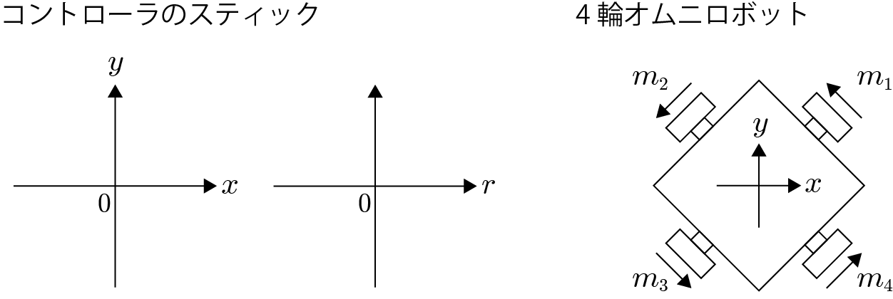

# omni-wheel-sim

- コントローラの2本のスティックを使用。
- 1本は$x-y$方向，もう1本は回転$r$
- $aとb$はゲイン
- 実際にモータードライバに入力する際は上限，下限で制限する必要がある。

        $m1 = -ax + ay -br$

        $m2 = -ax - ay -br$

        $m3 = ax - ay -br$

        $m4 = ax + ay -br$

